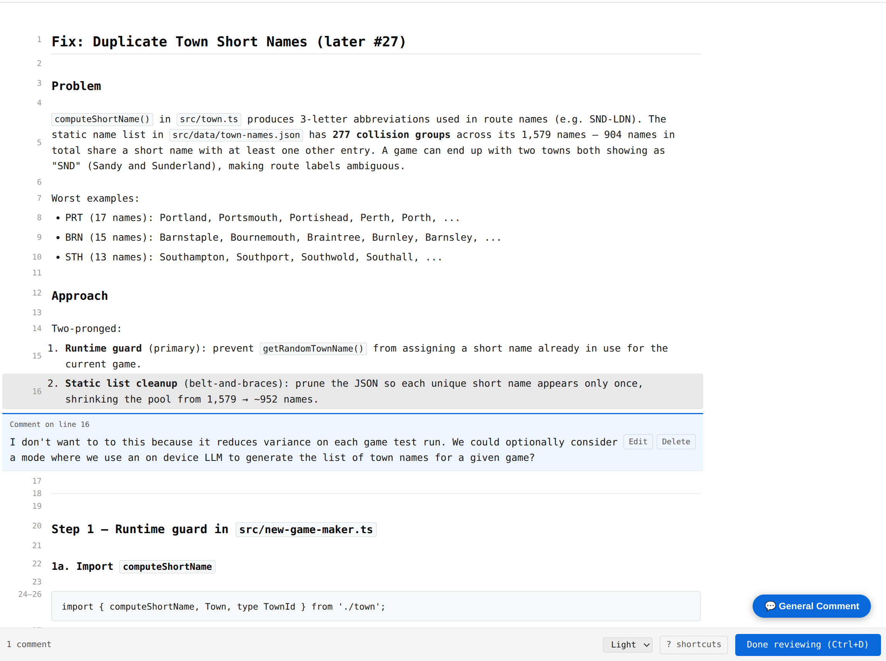

# ai-review

Reviewing an AI-generated plan in the terminal means reading a wall of text and
typing feedback into the chat. `ai-review` opens the plan in your browser so
you can annotate specific lines inline. Your comments are returned to the agent
so it can revise before acting.



---

## Prerequisites

- Node.js 18 or later

---

## Install

```bash
npm install -g @jackfranklin/ai-review
```

Or run without installing:

```bash
npx @jackfranklin/ai-review plan.md
```

---

## How it works

```
agent writes plan → ai-review opens browser → you annotate → agent revises → agent acts
```

The CLI starts a local server, opens the browser, and blocks until you click
**Approve** or **Request Changes**. Any comments you left are printed to stdout
and returned to the agent as context for revision. If you click Approve with no
comments, nothing is printed and the agent proceeds as planned.

By default this is a single round: the CLI exits once you submit. Pass
`--interactive` to keep it running instead, so an agent can revise the file in
place and push updates to your open tab without you re-running anything — see
[Interactive mode](#interactive-mode) below.

---

## Use with an AI agent

Three ready-made skills live in the [`skills/`](./skills) folder. Set them up
with your agent of choice to invoke them from your AI chat.

| Skill | File | Invoke with |
|-------|------|-------------|
| Review a plan before acting | [`skills/review-plan.md`](./skills/review-plan.md) | `/review-plan` |
| Review a diff before committing | [`skills/review-diff.md`](./skills/review-diff.md) | `/review-diff` |
| Walkthrough of AI-written code | [`skills/walkthrough.md`](./skills/walkthrough.md) | `/walkthrough` |

### review-plan

Tells the agent to pause before executing any multi-step plan, open the review UI
in **interactive mode**, and revise the plan file in place based on your comments —
looping through as many rounds as you need without restarting anything, until you
approve.

```
/review-plan
```

Or ask your agent: **"use /review-plan before you start"**.

### review-diff

Tells the agent to pipe the current diff into the review UI so you can annotate
changes before they are committed or pushed. This is a single round: interactive
mode isn't available here since diffs are piped over stdin rather than read from
a file the agent can revise (see [Interactive mode](#interactive-mode)).

```
/review-diff
```

Or ask your agent: **"use /review-diff to review changes"**.

### walkthrough

Rather than reviewing code, this skill is for *understanding* it. The agent
analyses the diff, structures the changes into logical steps with explanations
of the *why*, and opens the result in the review UI in **interactive mode**. You
read at your own pace, leave questions as inline comments, and the agent answers
them in chat and revises the document in place — looping until you approve.

```
/walkthrough
```

Or ask your agent: **"walk me through what you just wrote"**.

The flow:

```
agent writes code → /walkthrough → agent generates explanation →
browser opens → you read + leave questions → agent answers in chat +
revises the doc in place → (repeat until you approve)
```

---

## Use from the command line

`ai-review` is also useful on its own, independently of any AI agent — for
reviewing a plan written by hand, or for integrating into your own tooling.

```bash
# Review a plan file
ai-review plan plan.md

# Pipe plan from stdin
echo "$PLAN" | ai-review plan

# Review a git diff
git diff | ai-review diff

# With a title
ai-review plan --title "Auth refactor" plan.md
git diff | ai-review diff --title "Current Changes"

# Light or dark theme
ai-review plan --theme light plan.md
ai-review plan --theme dark plan.md

# Token-efficient mode for AI agents (omits full plan from output)
ai-review plan --diff-only plan.md
```

The browser opens automatically. If it doesn't, the URL is printed to stderr.
Annotate the plan, then click **Approve** or **Request Changes** (`a` / `r`).
The CLI prints the annotated result to stdout and exits.

Press **?** in the UI to see all keyboard shortcuts.

---

## Interactive mode

By default `ai-review` is single-shot: it blocks until you submit once, then
exits. Pass `--interactive` (or `-i`) to keep the loop open for multiple
rounds — useful for an AI agent that revises the plan file in place based on
your feedback and wants the browser to update without you re-running the CLI:

```bash
ai-review plan plan.md --interactive
```

`--interactive` requires a real file path, since the agent needs something on
disk to revise — it cannot be combined with piping from stdin (`ai-review
plan` with no file, or `ai-review diff`, which always reads from stdin).

An integrating AI agent should watch stdout for these lines:

- `Watching: <path>` — printed once at startup; the file the CLI is watching
  for changes.
- `=== FEEDBACK END ===` — printed after each round where you click
  **Request Changes**. The CLI keeps running; revise the file at `<path>` and
  the open browser tab updates automatically.
- `=== SESSION CLOSED: client disconnected ===` — printed (and the CLI exits
  non-zero) if the browser tab doesn't reconnect within 30 seconds of closing.
  Re-running the CLI against the same file recovers the session.

Clicking **Approve** ends the session the same way non-interactive mode does:
the CLI prints the final output and exits 0.

---

## Output format

When you leave comments, the CLI prints:

```markdown
<!-- ai-review output -->

## Annotated Plan

[plan line 1]
[plan line 2]
> **Comment (line 2):** This step is too vague — specify which database.
[plan line 3]
...

## Comment Summary

| Lines | Comment |
|-------|---------|
| 2 | This step is too vague — specify which database. |
| 8–11 | This whole block conflicts with the caching approach in step 4. |
```

The interleaved format gives spatial context; the summary table gives the agent
a quick structured view to work from. Both are always present by default.

When the `--diff-only` flag is passed, the `## Annotated Plan` section is omitted, and only the `## Comment Summary` is printed. This is useful for saving tokens when the AI already has the plan in its context history.

---

## Development

```bash
npm install
npm run dev        # UI dev server with hot reload on http://localhost:5173
npm run build      # Production build → dist/cli.js
npm run typecheck  # Type-check all packages
```

### Repository layout

```
src/
  cli/
    index.ts          # Entry point: arg parsing, server start, browser launch, stdout
    ui-html.ts        # Stub (dev) / inlined UI HTML (overwritten by build script)
  server/
    server.ts         # node:http server: GET /, GET /plan, GET /events, POST /submit
  ui/
    index.html        # Vite entry point
    main.ts           # Bootstraps the Lit app
    blocks.ts         # Markdown block grouper (fenced code, etc.)
    types.ts          # Shared Comment interface for UI code
    components/
      rp-app.ts            # Root component — state, keyboard nav, toolbar
      rp-plan-line.ts      # Single block: renders markdown, gutter, comment affordance
      rp-comment-box.ts    # Inline textarea for writing a comment
      rp-comment-thread.ts # Saved comment with Edit/Delete
    styles/
      base.css
scripts/
  build.ts            # Vite → inline UI HTML → esbuild → dist/cli.js
```
