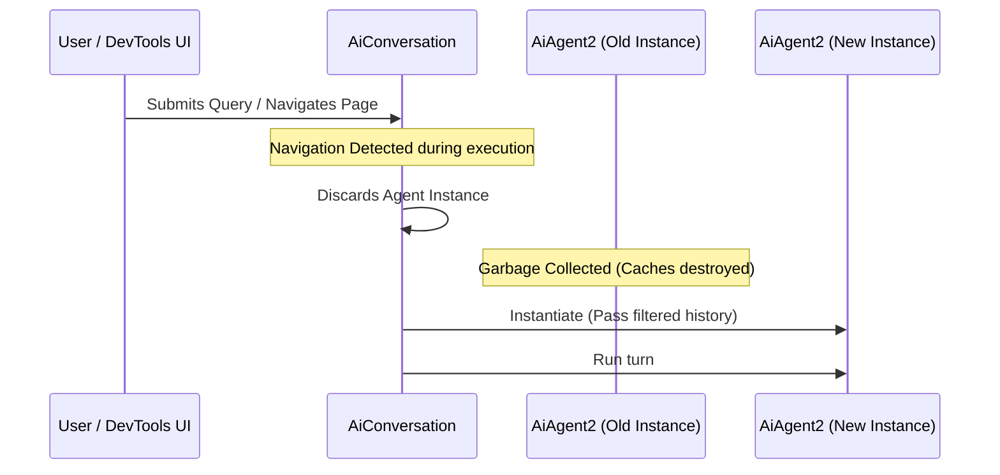

# Add dark mode support to the dashboard

Implement a dark/light mode toggle for the main dashboard and persist the
user's preference across sessions.

---

## Background

Users have requested dark mode for over a year. The design team has produced
Figma specs. Engineering estimates 2–3 days of work.

---

## Phase 1 — CSS custom properties

1. Audit the existing stylesheet and identify all hardcoded colour values.
2. Replace them with CSS custom properties on `:root`:
   ```css
   :root {
     --colour-bg: #ffffff;
     --colour-text: #1a1a1a;
     --colour-border: #e0e0e0;
   }

   [data-theme="dark"] {
     --colour-bg: #1e1e1e;
     --colour-text: #d4d4d4;
     --colour-border: #444444;
   }
   ```
3. Apply the `data-theme` attribute to `<html>` on load from localStorage.

   **Theme Color Scheme:**

   | Theme Element | Light Value | Dark Value |
   |:---|:---:|:---:|
   | Background | `#ffffff` | `#1e1e1e` |
   | Text | `#1a1a1a` | `#d4d4d4` |
   | Border | `#e0e0e0` | `#444444` |

---

## Phase 2 — Toggle component

- Add a `<ThemeToggle>` button to the top nav.
- On click: flip the attribute, persist to `localStorage`.
- Icon: sun for light mode, moon for dark mode.
- No animation required in this iteration.

---

## Phase 3 — System preference fallback

If no value is stored in localStorage, read `prefers-color-scheme`:

```js
const saved = localStorage.getItem('theme');
const preferred = window.matchMedia('(prefers-color-scheme: dark)').matches
  ? 'dark'
  : 'light';
document.documentElement.dataset.theme = saved ?? preferred;
```

---

## Phase 4 — Testing

- Unit test the toggle logic.
- Visual regression test: screenshot both themes on the three most-used pages.
- Manual QA checklist: forms, modals, charts, data tables.
    - **Edge Cases**:
        - Verify behavior when OS changes theme while app is open.
        - Check performance of theme switching on pages with many elements.

---

## Open questions

- Do we need dark mode for emails and PDFs in this iteration?
- Should the toggle live in the nav bar or in a user preferences panel?

---

## Success criteria

- All pages render correctly in both themes.
- Preference persists across browser sessions.
- No regressions on existing light-mode styles.
- Ships by end of sprint.

---

## Architectural Flow



